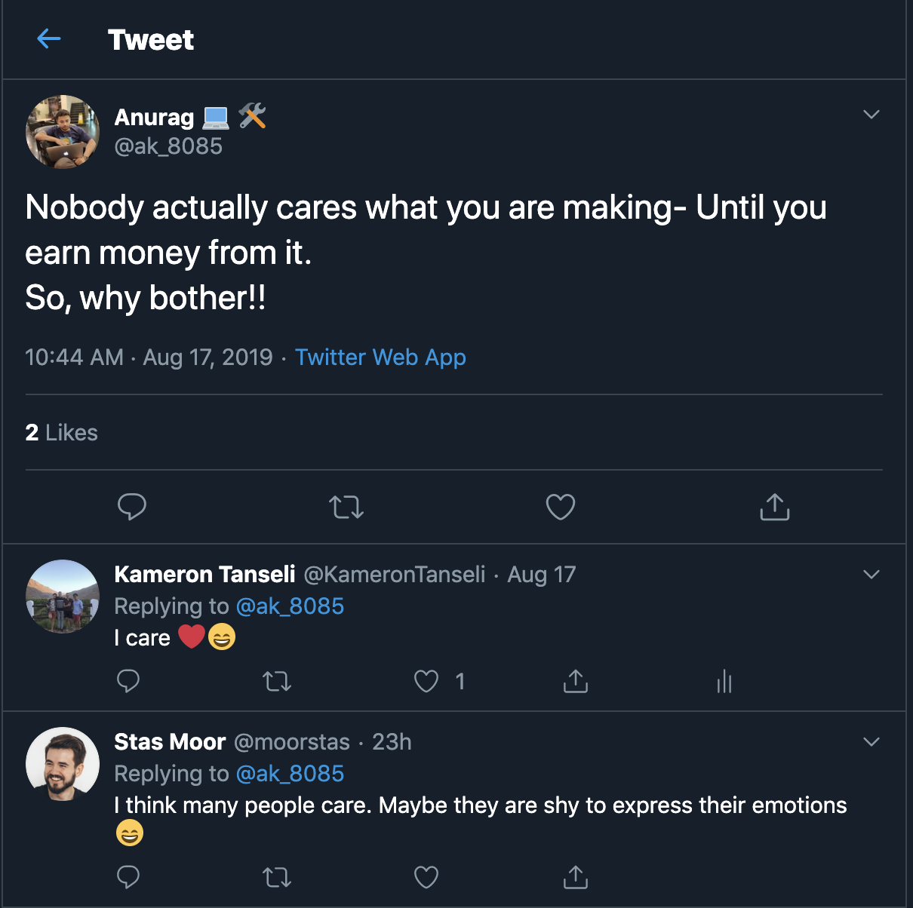
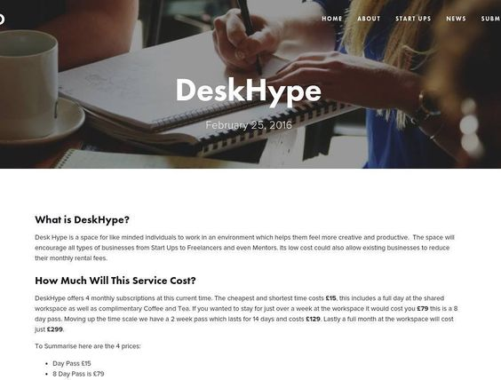

Something rather transformative happened yesterday. I replied to a tweet on Twitter, joking of course, but what made me stop and think for a moment was the tweet itself:

It's hard to see fellow Makers (Entrepreneurs) feel this way but I can see where they’re coming from. We have a strong survivorship bias in the Maker industry. The articles that make it to the top have flashy titles like ”*$200k MRR using just an Unbounce Landing Page*” which is cool and all but not very insightful into the people that made that happen.

This is when I reflected back to my days of running pyred.net where I used to interview small company founders and ask about their service and what they’re doing to grow the business etc:

It was a great time. I remember learning so much about companies and new products and pricing etc (especially as new founders are just starting out). The companies would get free exposure in return. It was a win for everyone.

So in an excited mood, I bought [makerinterviews.club](https://makerinterviews.club) (this site) and set out a plan to build a site which helps other Makers get to know the rest of the industry better ❤️.

My idea is to delve deeper into the personalities that make a Maker.

So... if your a maker hit me up 😅 @ [kam.tanseli@gmail.com](mailto:kam.tanseli@gmail.com).

